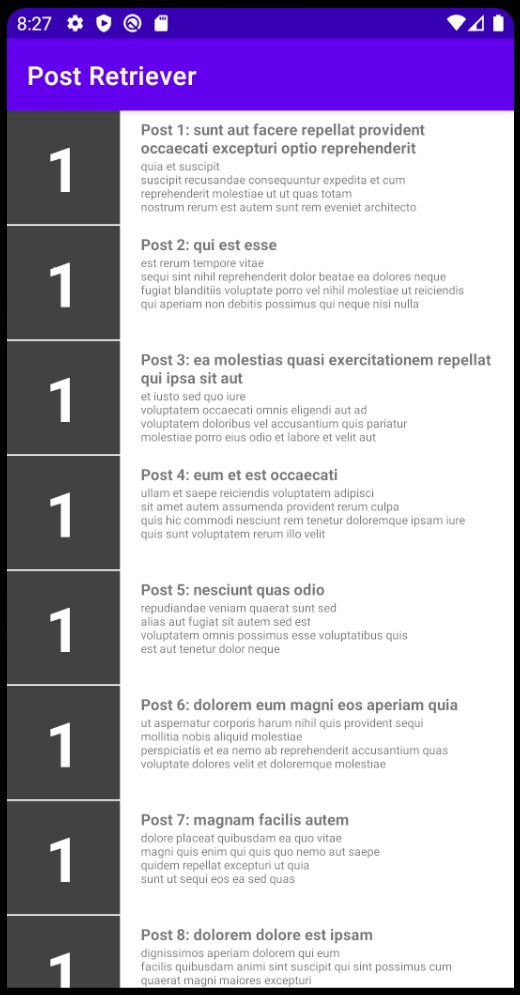
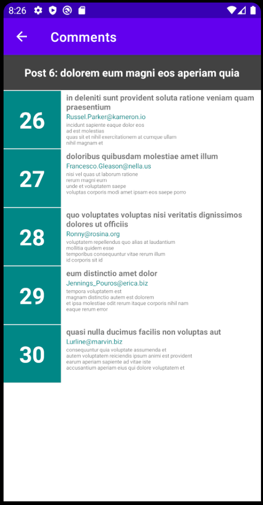

# Post Retriever

> Basic Android App that shows posts and their comments.

This app is an exercise that retrieves posts using an HTTP Get request using Retrofit, shows the posts in a RecyclerView, has the option to tap a post title, and then show their comments associated.

## Built With

- Kotlin
- Android Studio

## Getting Started

Get a local copy running the following command.

`git clone https://gitlab.com/meme_es/PostRetriever.git`

### Prerequisites

- Android Studio

### Usage

Open the project using Android Studio, select an Android Virtual Device (AVD), press the run triangle(Run) button or just press shift-10, and let the IDE make the rest.

The main activity shows you the posts retriever from `https://jsonplaceholder.typicode.com/posts` is you tap on the title of one post a new activity is launched to show their comments.

## Authors

👤 **Meme**

- GitLab: [@meme_es](https://gitlab.com/meme_es)
- Linkedin: [linkedin](https://www.linkedin.com/in/manuel-elias/)

## 🤝 Contributing

Contributions, issues, and feature requests are welcome!

Feel free to check the [issues page](https://gitlab.com/meme_es/PostRetriever/-/issues).

## Show your support

Give a ⭐️ if you like this project!

## 📝 License

This project is unlicensed.
